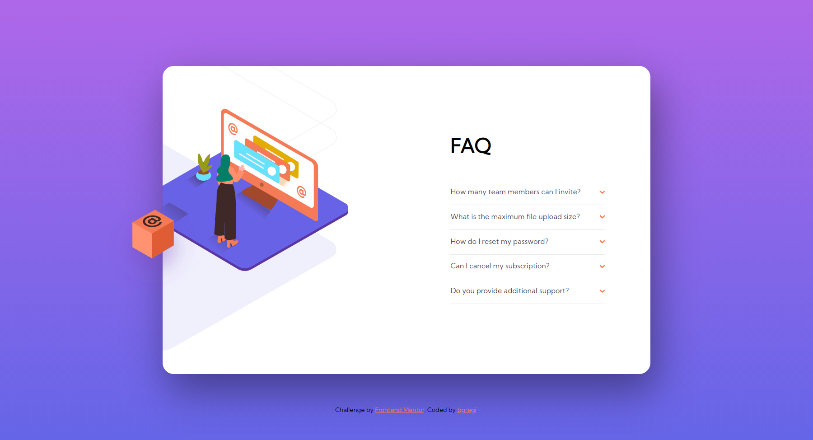

# Frontend Mentor - FAQ accordion card solution

This is a solution to the [FAQ accordion card challenge on Frontend Mentor](https://www.frontendmentor.io/challenges/faq-accordion-card-XlyjD0Oam). Frontend Mentor challenges help you improve your coding skills by building realistic projects. 

## Table of contents

- [Overview](#overview)
  - [The challenge](#the-challenge)
  - [Screenshot](#screenshot)
  - [Links](#links)
- [My process](#my-process)
  - [Built with](#built-with)
  - [What I learned](#what-i-learned)
  - [Continued development](#continued-development)
  - [Useful resources](#useful-resources)
- [Author](#author)

## Overview

### The challenge

Users should be able to:

- View the optimal layout for the component depending on their device's screen size
- See hover states for all interactive elements on the page
- Hide/Show the answer to a question when the question is clicked

### Screenshot

### Links

- Solution URL: [https://github.com/bgregi/faq-accordion-card](https://github.com/bgregi/faq-accordion-card)
- Live Site URL: [https://bgregi.github.io/faq-accordion-card/](https://bgregi.github.io/faq-accordion-card/)

## My process

### Built with

- Semantic HTML5 markup
- CSS custom properties
- SASS

### What I learned

This was definetely a step up for me, as I had to learn many new things. I tried to do the whole challenge using only CSS and HTML (no Javascript), which made me have to learn how to deal with SASS. I learned SASS through its official documentation, and had a great experience with it, which I intend to repeat in the next challenges.

I also had to deal with managing states with CSS, something I had no previous experience with.

### Continued development

I'm aware that I haven't done a perfect job, since my desktop layout doesn't really work for every screen size. This is why I intend to focus on positioning the elements in ways that work for different screens.

### Useful resources

- [Pure CSS Accordion](https://codepen.io/raubaca/pen/PZzpVe?editors=1100) - This helped me greatly in understanding the possibilities of CSS and SASS for managing HTML states.

## Author

- Website - [bgregi's GitHub Profile](https://github.com/bgregi)
- Frontend Mentor - [@bgregi](https://www.frontendmentor.io/profile/bgregi)